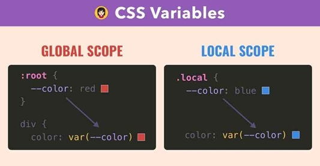

<!-- 

Todays goals: 

 - Explain CSS properties: Color, Font, Box model, Flexbox, Positioning

 How:

 - Build in front of them 
 - When a concept comes up, show slides

 -->

Web Engineering & Development (SWE 363) 
# 3.2 CSS Properties
### Dr. Omar Hammad
### Presented By Hasan Al-kaf

---

# Announcements 📣
- Phase 2 added 
- Grading started 

---

# In today's Lecture: 

- Color: background, text 
- Display: block, inline, inline-block
- Font: size, weight, family
- Text: alignment, decoration, transform
- Box model: border, padding, margin
- Flexbox: display, flex-direction, justify-content, align-items
- Positioning: static, relative, absolute, fixed, z-index

### Reference: 
- Zybook: 3.4 to 3.8

---

# Inspirational Websites
https://www.awwwards.com/
https://www.producthunt.com/
https://www.raycast.com

# CSS Variables Local Vs Global
 

---
# Color Systems

Named &#8594; easy keywords.

HEX &#8594; classic web format.

RGB(A) &#8594; direct red/green/blue values.

HSL(A) &#8594; intuitive hue/saturation/lightness.

HWB &#8594; intuitive for mixing white &amp; black.

color() &#8594; modern color spaces for wide-gamut displays.

---

# Box model 

---

# Flexbox 

---

---

<!-- _class: demo -->

>45m
# Demo
Starter code at: web-engineering-kfupm-classroom-3-2-css-properties/

---

# Next Class
- JS