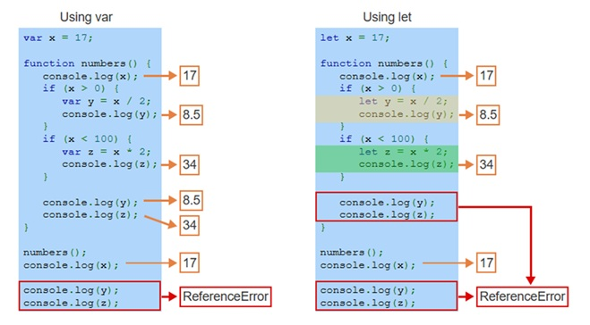

<!-- 

Todays goals: 

 - JS as a language 

 How:

 - Build in front of them 

 -->


Web Engineering & Development (SWE 363) 
# 4.1 JavaScript Fundamentals
### Hasan Al-kaf

---

# In today's lecture:

- JS Variables 
- JS Functions 
- JS Objects 
- JS Arrays 
- JS DOM 
- JS Events 

---

### Reference: 
- Zybook: 4.1 to 4.7

---

# Announcements 📣
- Project Assignment #1 is due This Thursday at 11:59 PM

---

### Examples:

# 📘 JavaScript Basics – Simple Examples

```javascript
<!-- 1. Variables -->

let name = "Ali";        // string
let age = 20;            // number
let isStudent = true;    // boolean
console.log(name, age, isStudent);

```
```javascript
<!-- 2. Functions ------------------------------------>

function greet(name) {
  return "Hello, " + name + "!";
}
console.log(greet("Ali"));
```
---
```javascript

<!-- 3. Objects ------------------------------------>
let student = {
  name: "Ali",
  age: 20,
  isStudent: true
};
console.log(student.name); // outputs "Ali"
```
```javascript
<!-- 4. Arrays ------------------------------------>
let fruits = ["Apple", "Banana", "Mango"];
console.log(fruits[0]);     // "Apple"
console.log(fruits.length); // 3
```
---
```html
<!-- 5. DOM ------------------------------------>
<!DOCTYPE html>
<html>
<body>
<p id="demo">Hello</p>
<script>
document.getElementById("demo").innerHTML = "Hello, JavaScript!";
</script>
</body>
</html>
```
```html
<!-- 6. Events -------------------------------------->
<!DOCTYPE html>
<html>
<body>
<button onclick="showMessage()">Click Me</button>
<p id="output"></p>
<script>
function showMessage() {
  document.getElementById("output").innerHTML = "Button was clicked!";}
</script>
</body>
</html>
```

---

### functions in JavaScript:

```javascript
function Greeting(){
    console.log("Helllo");
    alert("Alert me")
}
Greeting();
```
```javascript

const greet=function(){
    alert("Alert me")
}
greet();
```
```javascript
 const greet=()=>{
    alert("Alert me");
}
greet(); 
```
---

```javascript
 document.getElementById("btn").onclick = function() {
    alert("Alert me");
}; 
```
```javascript
 class Car {
  start() {
    alert("Alert me");
  }
}
const myCar = new Car();
myCar.start(); // Trigger method 
```
```javascript
  function sayHi() {
        alert("Alert me");  } 
```
```javascript

 (function(){
        alert("Alert me");
})();
```
---
```javascript

function Person(name) {
  this.name = name;
  this.sayHello = function() {
        alert("Alert me");
  };
}

const p1 = new Person("Hasan");
p1.sayHello(); // Triggered on object

```
```javascript

 document.getElementById("btn").addEventListener("click",()=>{
        alert("Alert me");

}); 

```
---
## Let and Var keywords
---


---
<!-- _class: demo -->

>45m
# Demo
Starter code at: web-engineering-kfupm-classroom-4-1-js-fundamentals/

---

# Next Class

- Js Part 2 