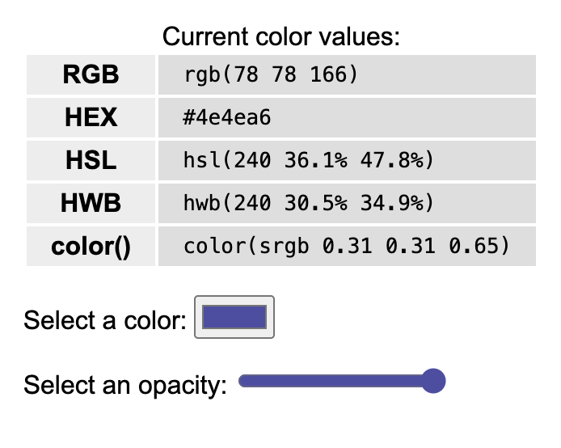

<!-- 

Todays goals: 

 - Explain CSS properties: Color, Font, Box model, Flexbox, Positioning

 -->

Web Engineering & Development (SWE 363) 
# 3.2 CSS Properties
### Created by: Dr. Omar Hammad and Dr. Khadijah Al Safwan

---

# Announcements 📣
- Phase 2 added 
- Grading started 

---

# In today's Lecture: 

- Font: size, weight, family
- Text: alignment, decoration, transform
- Color: background, text 
- Display: block, inline, inline-block
- Box model: border, padding, margin
- Flexbox: display, flex-direction, justify-content, align-items
- Positioning: static, relative, absolute, fixed, z-index

### Reference: 
- Zybook: 3.4 to 3.8

---

# Inspirational Websites
https://www.awwwards.com/
https://www.producthunt.com/
https://www.raycast.com

---

# RGB vs HEX 
 <!-- Hue, Saturation, and Lightness -->
 <!-- Hue, Whiteness, and Blackness -->
 
 
 [HTML Color Codes](https://htmlcolorcodes.com/)

---

# Box model 

[The Box Model Game](https://preview.webflow.com/preview/the-box-model-game-ca6721?utm_medium=preview_link&utm_source=designer&utm_content=the-box-model-game-ca6721&preview=3e6d150df85e31264571f886d38b8468&workflow=)

---

# Flexbox 

[The Flexbox Game](https://preview.webflow.com/preview/flexbox-game?utm_medium=preview_link&utm_source=designer&utm_content=flexbox-game&preview=d1a26b027c4803817087a91c651e321f&workflow)

[Flexbox Froggy Game](https://flexboxfroggy.com/)

---
# Positioning 

---
<!-- _class: demo -->

>30m
# Demo
Starter code at: web-engineering-kfupm-classroom-3-2-css-properties/

---

# Next Class
- JS